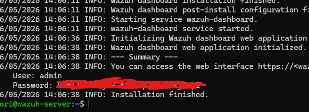
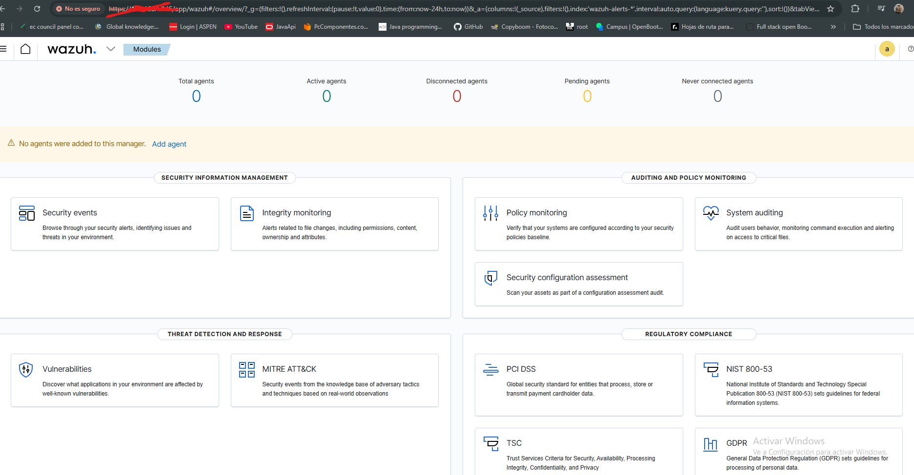

# Wazuh Home SIEM Lab


## Overview

This lab documents my first deployment of a home SIEM environment using Wazuh inside Ubuntu Server running on VirtualBox.

The goal of this project is to learn:
- Linux administration
- SIEM deployment
- SSH remote management
- Security monitoring
- Basic SOC concepts

---

## Environment

| Component | Technology |
|---|---|
| Host OS | Windows 11 |
| Virtualization | VirtualBox |
| Server OS | Ubuntu Server |
| SIEM | Wazuh |
| Access Method | SSH |

---

## Installation

The Wazuh server was installed using the official installation script.

```bash
curl -sO https://packages.wazuh.com/4.7/wazuh-install.sh
chmod +x wazuh-install.sh
sudo ./wazuh-install.sh -a -i
```

The `-i` parameter was required because Ubuntu 24 generated a compatibility warning during installation.

---

## Screenshots

### Wazuh Installation Finished



The installation completed successfully and generated the Wazuh dashboard credentials.

---

### Wazuh Dashboard



The Wazuh dashboard is accessible through the web interface and is operational.

---

## Skills Practiced

- Linux administration
- SIEM deployment
- SSH usage
- Virtualization
- Troubleshooting

---

## Status

Lab in progress.