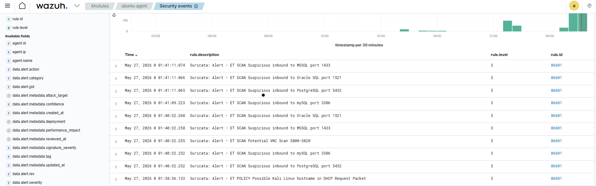
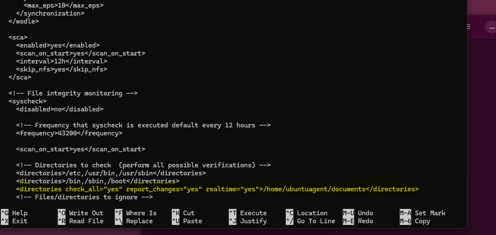
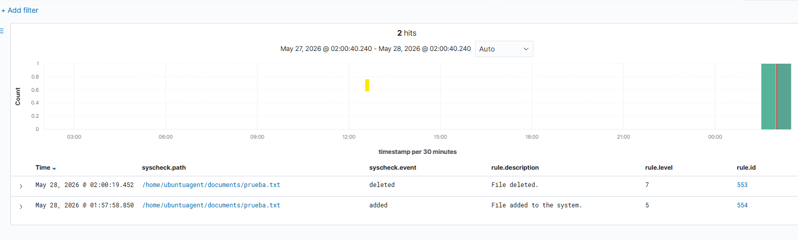
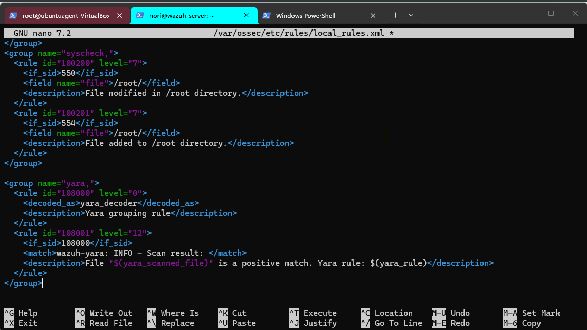
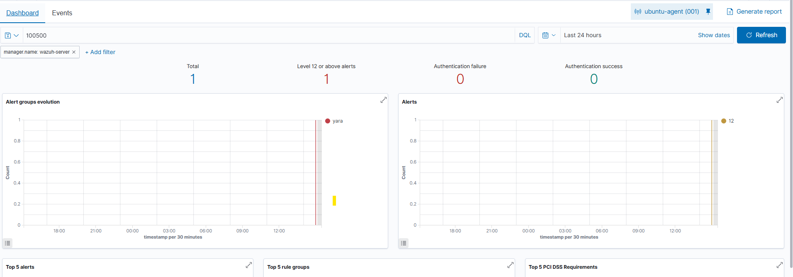

# Wazuh Home SIEM Lab


## Overview

This lab documents my first deployment of a home SIEM environment using Wazuh inside Ubuntu Server running on VirtualBox.

The goal of this project is to learn:
- Linux administration
- SIEM deployment
- SSH remote management
- Security monitoring
- Basic SOC concepts

---

## Environment

| Component | Technology |
|---|---|
| Host OS | Windows 11 |
| Virtualization | VirtualBox |
| Server OS | Ubuntu Server |
| SIEM | Wazuh |
| Access Method | SSH |

---

## Installation

The Wazuh server was installed using the official installation script.

```bash
curl -sO https://packages.wazuh.com/4.7/wazuh-install.sh
chmod +x wazuh-install.sh
sudo ./wazuh-install.sh -a -i
```

The `-i` parameter was required because Ubuntu 24 generated a compatibility warning during installation.

---

## Screenshots

### Wazuh Installation Finished


The installation completed successfully and generated the Wazuh dashboard credentials.

---

### Wazuh Dashboard


The Wazuh dashboard is accessible through the web interface and is operational.

### Ubuntu Agent Connected


An Ubuntu Desktop virtual machine was successfully connected to the Wazuh SIEM server as an active monitored endpoint.

The agent communication between the Ubuntu Desktop endpoint and the Wazuh manager was verified successfully.

### Suricata Traffic Detection


Suricata IDS was integrated with the Wazuh SIEM and successfully detected ICMP ping traffic generated during lab testing.

The generated alerts were forwarded to Wazuh and displayed in the Security Events dashboard.

### Suricata HOME_NET Configuration


The `HOME_NET` variable in the Suricata configuration was intentionally set to the specific IP address of the monitored Ubuntu endpoint instead of the full local network range.

This configuration was used in the lab environment to simulate external traffic targeting a protected host and to make ICMP and network scanning activity easier to detect during testing.

### Nmap Scan Detection



A Kali Linux virtual machine was used to perform network reconnaissance and port scanning activity against the monitored Ubuntu endpoint using Nmap.

Suricata IDS successfully detected the scan activity and forwarded the generated alerts to the Wazuh SIEM dashboard.

Detected activity included:
- MSSQL scan attempts
- Oracle SQL scan attempts
- MySQL scan attempts
- VNC scan detection
- Suspicious inbound scan activity

### File Integrity Monitoring (FIM) Configuration



Wazuh File Integrity Monitoring (FIM) was configured to monitor the `/home/ubuntuagent/documents` directory in real time.

The monitoring configuration was set with:
- `check_all="yes"` to verify all file attributes
- `report_changes="yes"` to log detected modifications
- `realtime="yes"` to generate alerts instantly when files are created, modified, or deleted

This configuration was used to simulate endpoint monitoring and suspicious file activity detection in the lab environment.

### File Integrity Monitoring Events



Wazuh File Integrity Monitoring (FIM) successfully detected file activity inside the monitored `/home/ubuntuagent/documents` directory.

During testing:
- A file named `prueba.txt` was created
- The same file was later deleted

Both actions generated real-time alerts in the Wazuh dashboard with different alert levels.

This demonstrates:
- Real-time file monitoring
- File creation detection
- File deletion detection
- Endpoint activity visibility through the SIEM

### Custom YARA Detection Rules



Custom Wazuh rules were configured to process YARA scan results and generate alerts when suspicious files matched defined malware signatures.

Additional custom Syscheck/FIM rules were also created to improve visibility of monitored file activity inside the lab environment.

This configuration demonstrates:
- Custom Wazuh rule creation
- YARA integration
- Malware signature detection
- XML rule customization
- SIEM alert tuning

### Custom Critical Alert Detection (Level 12)




Custom Wazuh Syscheck/FIM rules were created to detect suspicious file creation activity inside the Linux `/root/` directory.

A custom rule was configured in `local_rules.xml` to generate a **Level 12 critical alert** whenever a file is created inside `/root/`, simulating potentially malicious or unauthorized activity on a monitored Linux endpoint.


## Skills Practiced

- Linux administration
- SIEM deployment
- SSH usage
- Virtualization
- Troubleshooting
- Wazuh agent deployment
- Endpoint monitoring
- Linux endpoint management
- Suricata IDS integration
- Network traffic monitoring
- ICMP traffic detection
- Security event correlation

---

## Status

Lab in progress.