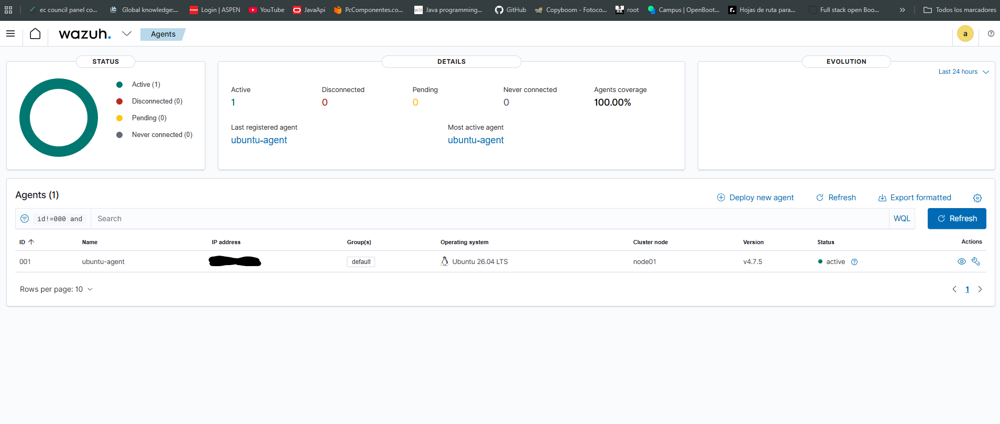
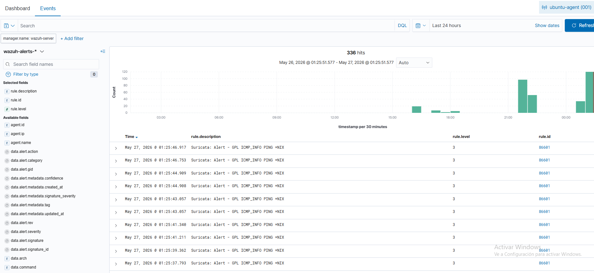
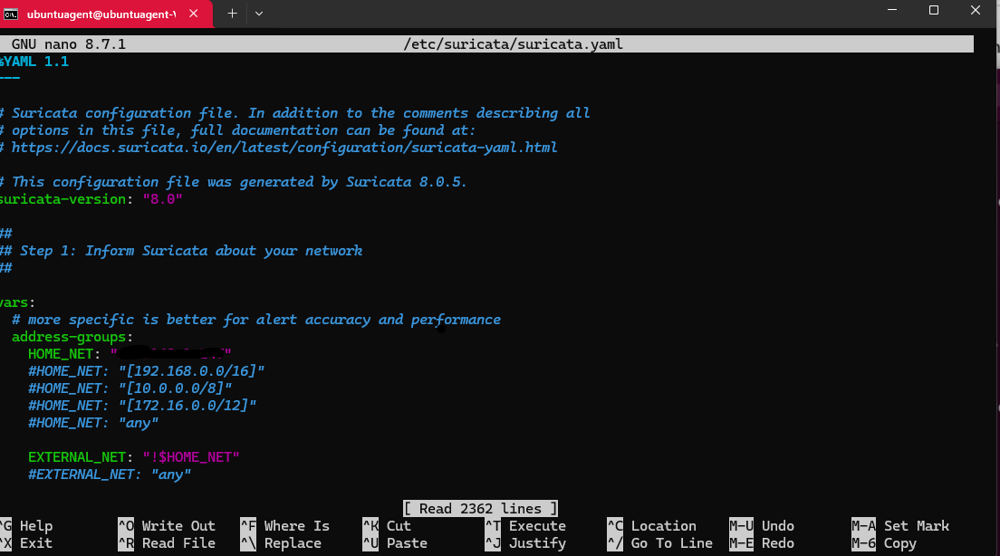

# Wazuh Home SIEM Lab


## Overview

This lab documents my first deployment of a home SIEM environment using Wazuh inside Ubuntu Server running on VirtualBox.

The goal of this project is to learn:
- Linux administration
- SIEM deployment
- SSH remote management
- Security monitoring
- Basic SOC concepts

---

## Environment

| Component | Technology |
|---|---|
| Host OS | Windows 11 |
| Virtualization | VirtualBox |
| Server OS | Ubuntu Server |
| SIEM | Wazuh |
| Access Method | SSH |

---

## Installation

The Wazuh server was installed using the official installation script.

```bash
curl -sO https://packages.wazuh.com/4.7/wazuh-install.sh
chmod +x wazuh-install.sh
sudo ./wazuh-install.sh -a -i
```

The `-i` parameter was required because Ubuntu 24 generated a compatibility warning during installation.

---

## Screenshots

### Wazuh Installation Finished


The installation completed successfully and generated the Wazuh dashboard credentials.

---

### Wazuh Dashboard


The Wazuh dashboard is accessible through the web interface and is operational.

### Ubuntu Agent Connected



An Ubuntu Desktop virtual machine was successfully connected to the Wazuh SIEM server as an active monitored endpoint.

The agent communication between the Ubuntu Desktop endpoint and the Wazuh manager was verified successfully.

### Suricata Traffic Detection



Suricata IDS was integrated with the Wazuh SIEM and successfully detected ICMP ping traffic generated during lab testing.

The generated alerts were forwarded to Wazuh and displayed in the Security Events dashboard.

### Suricata HOME_NET Configuration



The `HOME_NET` variable in the Suricata configuration was intentionally set to the specific IP address of the monitored Ubuntu endpoint instead of the full local network range.

This configuration was used in the lab environment to simulate external traffic targeting a protected host and to make ICMP and network scanning activity easier to detect during testing.
---

## Skills Practiced

- Linux administration
- SIEM deployment
- SSH usage
- Virtualization
- Troubleshooting
- Wazuh agent deployment
- Endpoint monitoring
- Linux endpoint management
- Suricata IDS integration
- Network traffic monitoring
- ICMP traffic detection
- Security event correlation

---

## Status

Lab in progress.