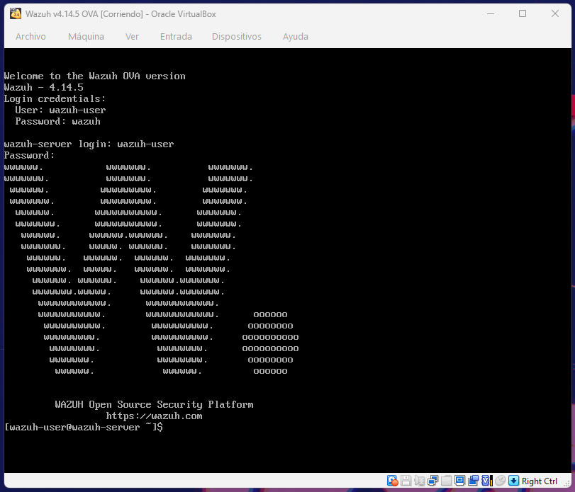
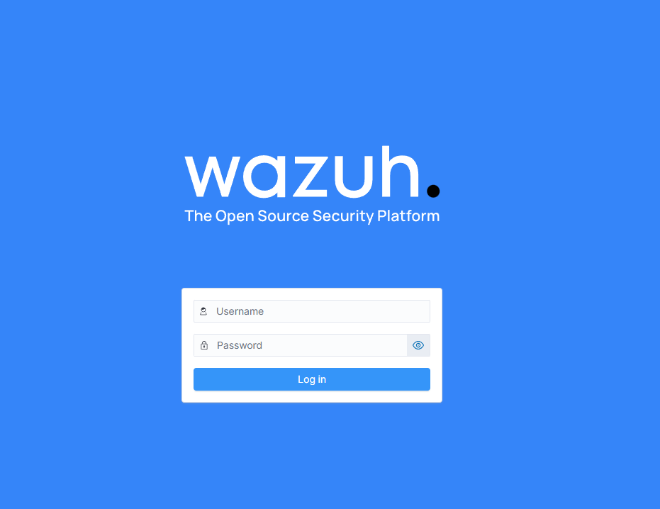

# Wazuh Home SIEM Lab

## Objective
Build a home SIEM using Wazuh for log monitoring and threat detection.

## Status
🚧 In Progress

# Wazuh Home SIEM Lab

## Overview

This project documents the deployment of a home SIEM environment using Wazuh inside VirtualBox.

The goal of this lab is to monitor endpoints, collect logs, detect suspicious activity, and practice defensive security monitoring in a controlled environment.

---

## Lab Environment

- Wazuh v4.14.5
- VirtualBox
- Windows 10 Host
- Kali Linux
- Home Network

---

## Objectives

- Deploy a working SIEM environment
- Monitor system and security logs
- Connect endpoints to Wazuh
- Detect suspicious activity
- Generate security alerts
- Practice blue team fundamentals

---

## Features

- Centralized log collection
- Security event monitoring
- Alert generation
- Endpoint monitoring
- Dashboard visualization
- Threat detection

---

## Screenshots

### Wazuh Virtual Machine Running

### Wazuh Dashboard

---

## Status

🚧 In Progress

Currently working on:
- Connecting agents
- Generating alerts
- Detection testing
- Documentation

---

## Skills Practiced

- SIEM Deployment
- Log Analysis
- Threat Detection
- Linux Administration
- Network Monitoring
- Blue Team Operations
- Virtualization

---

## Author

GitHub: https://github.com/nori097
