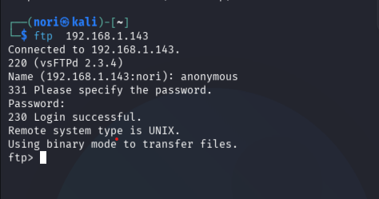
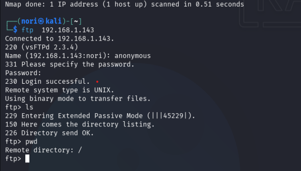

# Metasploitable2 Enumeration

## Objective

Perform basic enumeration against Metasploitable2 in a controlled lab environment.

## Target Machine
- Metasploitable2

## Attacker Machine
- Kali Linux

## Network Configuration

### Target IP
- 192.168.1.143

## Connectivity Test

The attacker machine successfully communicated with the target machine using ICMP (ping).


This project focuses on reconnaissance and service enumeration using Kali Linux against Metasploitable2.

## Initial Nmap Scan

An initial Nmap scan was performed against the target machine to identify exposed services and open ports.

### Command Used

```bash
nmap 192.168.1.143

Open Ports Detected
21/tcp FTP
22/tcp SSH
23/tcp Telnet
25/tcp SMTP
80/tcp HTTP
139/tcp NetBIOS
445/tcp SMB
3306/tcp MySQL
5432/tcp PostgreSQL

Observations

The target machine exposes multiple network services, increasing the attack surface significantly.

Several services appear outdated or insecure, including Telnet and older SMB-related services.

## FTP Enumeration

The FTP service running on port 21 was tested for anonymous authentication access.

### Command Used

```bash
ftp 192.168.1.143
```

### Result



Anonymous login was successfully allowed by the FTP service.

### Observations

- The FTP server is running vsFTPd 2.3.4.
- Anonymous authentication was accepted without valid credentials.
- The session started in the root directory `/`.
- Directory listing did not reveal visible files.

### Security Impact

Allowing anonymous FTP access may expose sensitive resources or allow unauthorized access to shared content.

## SMB Share Access

Access to the `tmp` SMB share was successfully obtained using anonymous authentication.

### Command Used

```bash
smbclient //192.168.1.143/tmp -N
```

### Enumerated Files

- .ICE-unix
- .X11-unix
- .X0-lock
- 4566.jsvc_up

### Observations

The share exposed internal system-related files and directories without requiring authentication.

### Security Impact

Accessible SMB shares may expose sensitive files, system information or allow attackers to interact with internal resources.
